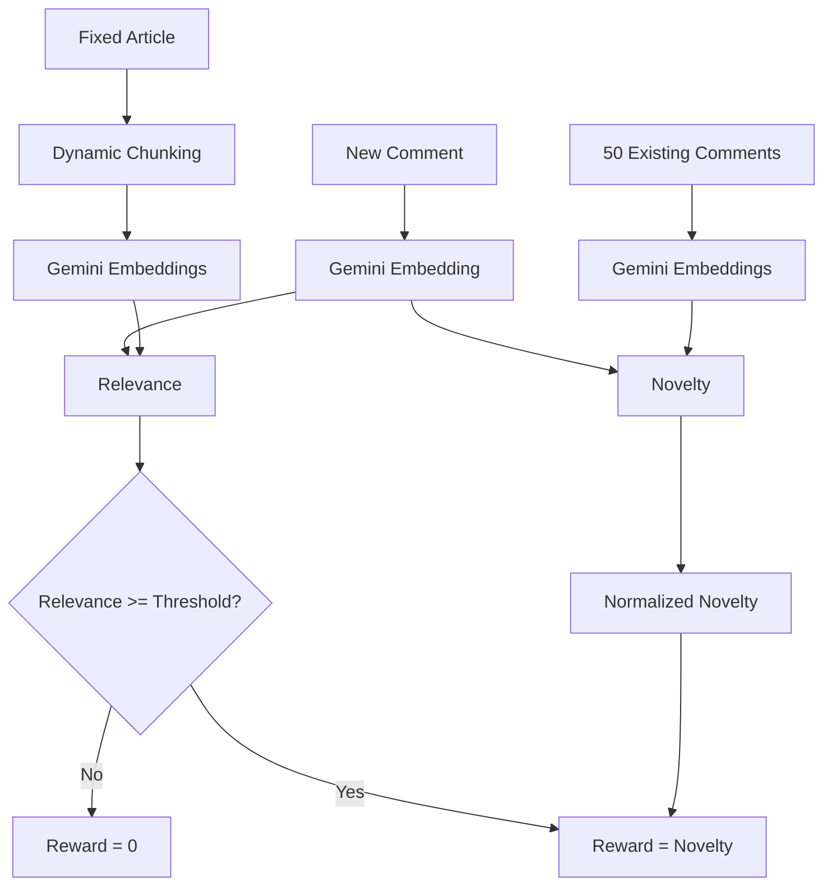

# SKILLS.md — Novelty Reward POC Implementation Specification

## 0. Mission

You are implementing the complete hackathon POC for **Rewarding Novelty in Submissions**.

The repository is already a monorepo. **Do not redesign, rename, flatten, or replace the existing folder structure.** First inspect the repository tree, existing `package.json` files, workspace configuration, frontend app, backend app, shared packages, TypeScript configuration, linting, formatting, and existing scripts. Extend the structure that already exists.

The final repository must provide:

1. A working Bun + TypeScript backend.
2. A working frontend that gives the judge a polished demo experience.
3. PlanetScale Postgres as the database.
4. Drizzle ORM as the schema/migration/query source of truth.
5. PostgreSQL `vector` / pgvector for embeddings.
6. Gemini embeddings using `gemini-embedding-001`.
7. Dynamic handling of fixed article/content length.
8. Comments/submissions represented as:
   - `headline`
   - `body`
   - `stance`
9. Comments are guaranteed to be under 100 words.
10. Around 50 existing submissions form the novelty comparison corpus.
11. A new candidate submission can be evaluated against that corpus.
12. Relevance to the fixed article/content is measured separately from novelty.
13. Novelty is normalized to `[0, 1]`.
14. A minimum relevance gate prevents highly novel but irrelevant submissions from receiving reward.
15. Seed data and a seed command must populate the database, including embeddings.
16. Automated tests must demonstrate the required behavior.
17. The UI must expose enough intermediate information that a judge can understand why a submission received its score.

The implementation should be production-quality enough to demonstrate strong engineering, while remaining appropriately scoped for a POC.

---

# 1. Non-Negotiable Engineering Rules

## 1.1 Preserve the existing monorepo

Before changing anything:

- inspect the complete repository tree;
- inspect root `package.json`;
- inspect workspace configuration;
- inspect every app/package `package.json`;
- inspect existing TypeScript configuration;
- inspect existing frontend routing;
- inspect existing backend entrypoints;
- inspect existing environment/configuration conventions.

Do NOT create a second competing application structure.

Use the existing apps/packages and naming conventions.

If a suitable dependency/framework already exists, use it.

If a backend framework is absent and one is genuinely needed, prefer a lightweight Bun-compatible TypeScript HTTP framework such as Hono rather than introducing a large framework.

If the frontend is already React/Vite, preserve it.

---

# 2. Product Definition

The system evaluates a user-generated submission against:

1. one fixed piece of content;
2. approximately 50 submissions already made in response to that same content.

The system answers two separate questions:

### Relevance

> Does this submission meaningfully relate to the fixed content?

### Novelty

> How different is the idea expressed by this submission from the ideas already expressed by the other submissions?

The final reward combines these:

```text
if relevance < threshold:
    reward = 0
else:
    reward = normalized_novelty
```

This is intentionally a hard relevance gate.

A highly novel but irrelevant submission must not be rewarded.

---

# 3. Domain Model

Use the following conceptual entities.

## 3.1 Article

A fixed piece of content that submissions respond to.

```ts
type Article = {
  id: string;
  title: string;
  content: string;
  createdAt: Date;
};
```

The article length must NOT be hard-coded.

The system must work with short and long fixed content.

Do not assume the article is always 100 words.

---

## 3.2 Article Chunk

Long fixed content may be split into semantically useful chunks.

```ts
type ArticleChunk = {
  id: string;
  articleId: string;
  chunkIndex: number;
  content: string;
  embedding: number[];
};
```

For short content, use one chunk.

Do not chunk submissions merely because article chunking exists.

---

## 3.3 Submission

Every submission is under 100 words.

```ts
type Stance =
  | "support"
  | "oppose"
  | "mixed";

type Submission = {
  id: string;
  articleId: string;
  headline: string;
  body: string;
  stance: Stance;
  createdAt: Date;
};
```

The submission is one semantic unit.

Use ONE embedding for the complete submission.

Do not split a submission into chunks.

---

## 3.4 Submission Embedding

Store one embedding per submission.

For novelty representation:

```text
Headline + Body
```

Do NOT include stance initially.

Reason:

Two submissions expressing the same idea but different stance should not automatically become highly novel merely because the stance field differs.

---

## 3.5 Evaluation

An evaluation represents the system's scoring decision for one candidate submission.

```ts
type Evaluation = {
  id: string;
  articleId: string;
  candidateSubmissionId: string;

  relevanceScore: number;
  relevanceThreshold: number;
  relevancePassed: boolean;

  rawNovelty: number;
  normalizedNovelty: number;

  rewardScore: number;

  createdAt: Date;
};
```

The system should retain enough data to explain a score.

---

# 4. Database

Use:

```text
PlanetScale Postgres
        +
PostgreSQL vector extension / pgvector
        +
Drizzle ORM
```

Drizzle is the source of truth for tables and indexes.

Do not manually maintain a separate ORM schema.

The `vector` extension itself may require a migration statement such as:

```sql
CREATE EXTENSION IF NOT EXISTS vector;
```

This is infrastructure required by PostgreSQL, not a replacement for the Drizzle schema.

---

# 5. Required Database Tables

Implement at minimum:

## `articles`

Fields:

- `id UUID PRIMARY KEY`
- `title TEXT NOT NULL`
- `content TEXT NOT NULL`
- `created_at TIMESTAMPTZ NOT NULL DEFAULT NOW()`

## `article_chunks`

Fields:

- `id UUID PRIMARY KEY`
- `article_id UUID NOT NULL REFERENCES articles(id)`
- `chunk_index INTEGER NOT NULL`
- `content TEXT NOT NULL`
- `embedding VECTOR(768)`
- `created_at TIMESTAMPTZ NOT NULL DEFAULT NOW()`

Add:

```text
UNIQUE(article_id, chunk_index)
```

## `submissions`

Fields:

- `id UUID PRIMARY KEY`
- `article_id UUID NOT NULL REFERENCES articles(id)`
- `headline TEXT NOT NULL`
- `body TEXT NOT NULL`
- `stance TEXT NOT NULL`
- `embedding VECTOR(768)`
- `created_at TIMESTAMPTZ NOT NULL DEFAULT NOW()`

Validate stance at the application layer and, where practical, at the database layer.

Allowed values:

```text
support
oppose
mixed
```

## `evaluations`

Fields:

- `id UUID PRIMARY KEY`
- `article_id UUID NOT NULL REFERENCES articles(id)`
- `candidate_submission_id UUID NOT NULL REFERENCES submissions(id)`
- `relevance_score DOUBLE PRECISION NOT NULL`
- `relevance_threshold DOUBLE PRECISION NOT NULL`
- `relevance_passed BOOLEAN NOT NULL`
- `raw_novelty DOUBLE PRECISION NOT NULL`
- `normalized_novelty DOUBLE PRECISION NOT NULL`
- `reward_score DOUBLE PRECISION NOT NULL`
- `created_at TIMESTAMPTZ NOT NULL DEFAULT NOW()`

Add useful indexes on:

```text
articles.id
article_chunks.article_id
submissions.article_id
evaluations.article_id
evaluations.candidate_submission_id
```

---

# 6. Vector Configuration

Use:

```text
Model: gemini-embedding-001
Task type: SEMANTIC_SIMILARITY
Dimensions: 768
```

Centralize these values in configuration.

Do NOT scatter `768` and the model name throughout the codebase.

Example:

```ts
const embeddingConfig = {
  model: "gemini-embedding-001",
  dimensions: 768,
  taskType: "SEMANTIC_SIMILARITY",
};
```

Environment variables should override defaults where appropriate.

Required environment variables:

```env
DATABASE_URL=
GEMINI_API_KEY=
GEMINI_EMBEDDING_MODEL=gemini-embedding-001
GEMINI_EMBEDDING_DIMENSIONS=768
```

Never commit secrets.

---

# 7. Gemini Embedding Service

Use the official Google GenAI JavaScript SDK:

```text
@google/genai
```

Create one centralized embedding service.

Responsibilities:

- embed one text;
- optionally batch embed texts;
- validate returned vectors;
- normalize vectors;
- expose a clean application-level API.

Do not call Gemini directly from random route handlers.

Example interface:

```ts
interface EmbeddingService {
  embedText(text: string): Promise<number[]>;
  embedMany(texts: string[]): Promise<number[][]>;
}
```

Normalize vectors before storage/usage.

Fail clearly when Gemini returns an empty or malformed embedding.

---

# 8. Content Preprocessing

## 8.1 Fixed article

Article length is dynamic.

For short content:

```text
article
  ↓
one chunk
```

For long content:

```text
article
  ↓
semantic/sentence-aware chunks
  ↓
multiple chunks
```

Do not blindly cut words in the middle of sentences.

Prefer:

1. paragraph boundaries;
2. sentence boundaries;
3. maximum word/token limits as a fallback.

Keep chunking deterministic.

The chunking strategy must be configurable.

Example configuration:

```ts
{
  maxWordsPerChunk: 400,
  overlapWords: 0
}
```

Do not over-engineer semantic chunking for the POC.

---

## 8.2 Submission

Never chunk submissions.

A submission is already a semantic unit and is guaranteed to be under 100 words.

Build the novelty representation:

```text
Headline: <headline>
Body: <body>
```

Do not include stance.

---

# 9. Relevance Algorithm

Relevance answers:

> How strongly does the candidate submission relate to the fixed article?

For a short article:

```text
article embedding
        +
candidate embedding
        ↓
cosine similarity
```

For a long article:

```text
candidate embedding
       ↓
similarity against every article chunk
       ↓
top-K chunk similarities
       ↓
aggregate
```

Use configurable:

```ts
RELEVANCE_TOP_K = 3
```

Initial aggregation:

```text
relevance =
average(top K cosine similarities)
```

If there are fewer than K chunks, use all available chunks.

Keep the implementation deterministic.

---

# 10. Novelty Algorithm

Novelty answers:

> How different is this candidate from the existing submissions?

Let:

```text
candidate = x
existing submissions = S1 ... S50
```

Calculate:

```text
cosine_similarity(x, Si)
```

for every existing submission.

Sort descending:

```text
similarity_1 >= similarity_2 >= ... >= similarity_50
```

Take the nearest K.

Initial K:

```text
5
```

Initial weights:

```text
0.40
0.25
0.15
0.12
0.08
```

The weights must sum to 1.

Calculate:

```text
local_similarity =
    0.40 * similarity_1 +
    0.25 * similarity_2 +
    0.15 * similarity_3 +
    0.12 * similarity_4 +
    0.08 * similarity_5
```

Then:

```text
raw_novelty = 1 - local_similarity
```

Do not call `raw_novelty` the final reward.

---

# 11. Novelty Calibration

Raw embedding distance is model/distribution dependent.

We need an interpretable `[0,1]` novelty score.

Use empirical percentile calibration.

For every existing submission:

```text
leave submission i out
compare i against all other submissions
calculate raw novelty
```

This produces:

```text
D = [
  novelty_1,
  novelty_2,
  ...
  novelty_50
]
```

For candidate novelty `d`:

```text
normalizedNovelty =
    count(D[i] <= d) / D.length
```

Clamp to:

```text
0 <= normalizedNovelty <= 1
```

Interpretation:

```text
0.90
```

means approximately:

> This candidate is more novel than 90% of the existing submission population.

Do not describe this as an absolute probability of originality.

---

# 12. Relevance Threshold

The relevance threshold must be configurable.

Do not bury a magic number in the scoring function.

Example configuration:

```text
RELEVANCE_THRESHOLD=0.65
```

The exact threshold must be tunable through configuration and evaluation experiments.

The final implementation should make it easy to test:

```text
0.50
0.55
0.60
0.65
0.70
0.75
```

The seed/evaluation dataset should provide enough labeled examples to select a reasonable threshold.

Do not claim that 0.65 is theoretically correct.

---

# 13. Final Reward

The central scoring rule is:

```text
if relevance < threshold:
    reward = 0
else:
    reward = normalizedNovelty
```

Equivalent:

```ts
reward =
  relevancePassed
    ? normalizedNovelty
    : 0;
```

Clamp final reward to `[0,1]`.

Never allow NaN, Infinity, negative values, or values above 1.

---

# 14. Similarity Utilities

Implement tested utility functions:

```ts
cosineSimilarity(a, b)
```

Requirements:

- equal dimensions;
- reject empty vectors;
- reject dimension mismatch;
- handle zero vectors explicitly;
- deterministic;
- return a sensible numeric value.

Also implement:

```ts
rankSimilarities()
topK()
weightedTopKSimilarity()
calculateRawNovelty()
percentile()
clamp01()
```

Unit test each independently.

---

# 15. API

Follow the existing backend routing conventions.

Do not create a second server.

If there is no existing API convention, implement REST endpoints similar to:

## Health

```http
GET /api/health
```

Response:

```json
{
  "ok": true
}
```

## Articles

```http
GET /api/articles
GET /api/articles/:articleId
POST /api/articles
```

`POST /api/articles` accepts:

```json
{
  "title": "Example article",
  "content": "..."
}
```

Creating an article should:

1. validate input;
2. persist article;
3. dynamically chunk content;
4. embed chunks;
5. persist chunks;
6. return article metadata.

---

## Submissions

```http
GET /api/articles/:articleId/submissions
POST /api/articles/:articleId/submissions
GET /api/submissions/:submissionId
```

POST body:

```json
{
  "headline": "Example headline",
  "body": "Example comment",
  "stance": "support"
}
```

Validation:

- headline required;
- body required;
- stance must be one of allowed values;
- submission must be under 100 words;
- article must exist.

On creation:

1. validate;
2. construct embedding text;
3. call Gemini;
4. store submission;
5. store embedding;
6. return submission.

---

# 16. Evaluation API

Primary endpoint:

```http
POST /api/articles/:articleId/evaluate
```

Request:

```json
{
  "headline": "New comment",
  "body": "This policy could...",
  "stance": "support"
}
```

The candidate does not need to be permanently saved unless the UI needs it.

Evaluation should:

1. validate candidate;
2. load article;
3. load article chunks;
4. embed candidate;
5. calculate relevance;
6. load existing submissions;
7. calculate nearest neighbors;
8. calculate raw novelty;
9. calculate normalized novelty;
10. apply relevance gate;
11. persist evaluation;
12. return complete scoring breakdown.

Response:

```json
{
  "candidate": {
    "headline": "...",
    "body": "...",
    "stance": "support"
  },
  "relevance": {
    "score": 0.81,
    "threshold": 0.65,
    "passed": true
  },
  "novelty": {
    "raw": 0.61,
    "normalized": 0.84
  },
  "reward": 0.84,
  "neighbors": [
    {
      "submissionId": "...",
      "similarity": 0.72
    }
  ]
}
```

The response should be explainable enough for the frontend to visualize.

---

# 17. Evaluation History

Implement:

```http
GET /api/articles/:articleId/evaluations
GET /api/evaluations/:evaluationId
```

The frontend should be able to show previous evaluations.

---

# 18. Seed System

Create a proper seed script.

The seed must create:

1. one demo article;
2. approximately 50 existing submissions;
3. embeddings for article/chunks;
4. embeddings for all submissions;
5. controlled categories;
6. enough candidates for demonstration;
7. optional evaluation examples.

The seed must be deterministic at the text/data level.

Do NOT generate arbitrary random comments on every run.

---

# 19. Seed Dataset Design

Use one coherent news-style article.

The exact topic is not important.

Create approximately:

```text
10 relevant + repetitive
10 relevant + medium novelty
10 relevant + high novelty
10 irrelevant + high novelty
5  irrelevant + repetitive
5  borderline relevance
```

Total:

```text
50
```

The comments must all be under 100 words.

Each comment should contain:

- headline;
- body;
- stance.

---

# 20. Golden Labels

Store seed labels separately from production scoring.

Use:

```ts
type GoldenLabel = {
  submissionId: string;
  relevance:
    | "high"
    | "medium"
    | "low";

  novelty:
    | "high"
    | "medium"
    | "low";

  shouldReward: boolean;
};
```

These labels are evaluation metadata.

Do not feed them into the scoring algorithm.

The scoring algorithm must not cheat by reading labels.

---

# 21. Important Seed Cases

Explicitly include:

### Case A — Duplicate

Almost identical to an existing comment.

Expected:

```text
low novelty
```

### Case B — Paraphrase

Different wording, same underlying idea.

Expected:

```text
low novelty
```

This proves semantic rather than lexical novelty.

### Case C — Relevant new idea

Discusses the article but introduces an idea not represented in the existing corpus.

Expected:

```text
high relevance
high novelty
high reward
```

### Case D — Irrelevant but highly novel

Completely unrelated to the article but semantically different from all existing comments.

Expected:

```text
high novelty
low relevance
reward = 0
```

This is one of the most important demonstrations.

### Case E — Relevant but repetitive

Relevant but repeats a common idea.

Expected:

```text
high relevance
low novelty
low reward
```

### Case F — Lexically unusual but semantically repetitive

Uses strange wording but expresses an existing idea.

Expected:

```text
low novelty
```

---

# 22. Seed CLI

Add scripts following the existing monorepo conventions.

At minimum:

```bash
bun run db:generate
bun run db:migrate
bun run db:seed
bun run test
bun run dev
```

If the repository uses package-level scripts, preserve that convention.

The seed script should be safe to rerun.

Prefer an explicit:

```bash
bun run db:seed
```

that either:

- upserts a known demo article and known seed submissions; or
- clears only the POC/demo dataset and recreates it.

Do NOT accidentally delete unrelated database data.

Use a stable demo identifier or unique demo slug if appropriate.

---

# 23. Seed Embedding Behavior

The seed script must call Gemini to generate real embeddings.

Do not use fake random vectors.

This POC is specifically demonstrating semantic novelty.

If `GEMINI_API_KEY` is missing, fail with a clear message explaining how to configure it.

Batch embeddings where the SDK/API supports it to reduce latency.

Avoid unnecessary duplicate API calls.

---

# 24. Backend Architecture

Use clear separation of concerns.

Preferred conceptual layers:

```text
routes
  ↓
controllers / handlers
  ↓
services
  ↓
domain algorithms
  ↓
repositories
  ↓
database
```

Do not put the entire evaluation algorithm inside a route handler.

Suggested service boundaries:

```text
ArticleService
SubmissionService
EmbeddingService
ArticleChunkingService
RelevanceService
NoveltyService
CalibrationService
EvaluationService
```

Repositories should handle persistence.

Domain/calculation services should be testable without HTTP.

---

# 25. Evaluation Service

Create one orchestration service responsible for the complete pipeline.

Conceptually:

```ts
evaluateCandidate({
  articleId,
  headline,
  body,
  stance
})
```

Algorithm:

```text
1. Validate candidate
2. Load article
3. Load article chunks
4. Embed candidate
5. Calculate relevance
6. Load existing submissions
7. Compare candidate against existing submissions
8. Calculate top-K weighted similarity
9. Calculate raw novelty
10. Calculate calibrated novelty
11. Apply relevance threshold
12. Persist evaluation
13. Return explainable result
```

The orchestration service should not contain low-level SQL.

---

# 26. Avoiding Data Leakage

The candidate must not be included in the novelty corpus used to evaluate itself.

If a candidate is persisted before evaluation, exclude its own ID from neighbor queries.

For leave-one-out calibration:

```text
submission i
```

must be compared only against:

```text
all submissions except i
```

Never compare a submission against itself.

---

# 27. Existing Corpus Requirements

The novelty corpus should be tied to the same article:

```text
WHERE article_id = candidate.articleId
```

Never compare a comment for Article A against comments from Article B.

Novelty is contextual to the submission population for the same fixed content.

---

# 28. Vector Search Strategy

For the POC corpus of approximately 50 submissions:

### Initial implementation

Retrieve the relevant submission embeddings and calculate cosine similarity in TypeScript.

This is intentionally simple and exact.

It makes the algorithm transparent and avoids approximate nearest-neighbor behavior affecting the hackathon demonstration.

### Database support

Still store embeddings in pgvector.

Also implement a clean repository abstraction so vector search can later move to SQL:

```ts
findNearestSubmissions(
  articleId,
  embedding,
  limit
)
```

Do not couple the domain scoring algorithm directly to pgvector SQL.

---

# 29. Frontend

The frontend should feel like a polished judge-facing demo, not an AI chatbot.

Do not create a generic "AI assistant" interface.

Build a dashboard/demo around the novelty problem.

Suggested screens/components:

```text
Dashboard
  ├── Article panel
  ├── Existing submission statistics
  ├── Candidate submission form
  ├── Evaluate button
  ├── Reward score
  ├── Relevance score
  ├── Novelty score
  ├── Relevance gate status
  ├── Nearest submission explanations
  └── Evaluation history
```

---

# 30. Recommended Demo UX

Top section:

```text
Fixed Content
```

Display:

- article title;
- article text;
- number of existing submissions.

Second section:

```text
Submit New Comment
```

Fields:

- headline;
- body;
- stance.

Third section:

```text
Evaluation Result
```

Display:

```text
Reward
0.84 / 1.00

Relevance
0.81
PASS

Novelty
0.84
```

Then:

```text
Why this score?
```

Show:

- nearest comments;
- their similarity;
- novelty calculation;
- relevance result;
- final reward rule.

This explainability is important for a hackathon judge.

---

# 31. Visualization

Use simple visual components.

Examples:

```text
Reward       ████████████████░░░░ 0.84
Relevance    ███████████████░░░░░ 0.81
Novelty      █████████████████░░░ 0.84
```

Or clean progress bars/gauges.

Do not overdo animations.

The important thing is that the judge can understand:

```text
different from other comments
+
still relevant to article
=
reward
```

---

# 32. Neighbor Explanation

For the top nearest submissions, show:

```text
Most similar existing submissions

1. "Policy will help small businesses"
   Similarity: 0.72

2. "Small companies may benefit..."
   Similarity: 0.65

3. "This could reduce costs for..."
   Similarity: 0.58
```

Explain:

```text
High similarity → lower novelty
Low similarity → higher novelty
```

Do not expose raw embeddings.

---

# 33. API Error Handling

Every endpoint must return predictable errors.

Example:

```json
{
  "error": {
    "code": "VALIDATION_ERROR",
    "message": "Submission body must be under 100 words."
  }
}
```

Use appropriate HTTP status codes.

At minimum:

```text
400 validation
404 not found
409 conflict where appropriate
500 unexpected server error
```

Do not expose stack traces in production responses.

Log server-side details.

---

# 34. Validation

Use the repository's existing validation library if present.

Otherwise use Zod.

Validate:

### Article

```text
title: non-empty
content: non-empty
```

### Submission

```text
headline: non-empty
body: non-empty
stance: support | oppose | mixed
body word count < 100
```

Use a reusable word-count function.

Do not use character count as a substitute for the 100-word rule.

---

# 35. Tests

Use Bun's test runner unless the repository already has a different established testing framework.

At minimum:

```text
tests/
  cosine.test.ts
  novelty.test.ts
  relevance.test.ts
  reward.test.ts
  validation.test.ts
  evaluation.test.ts
```

Follow the existing repository structure if tests already live elsewhere.

---

# 36. Required Behavioral Tests

## Test 1 — Duplicate

Given:

```text
candidate ≈ existing comment
```

expect:

```text
novelty is low
```

---

## Test 2 — Paraphrase

Given:

```text
same idea
different wording
```

expect:

```text
novelty remains low
```

This demonstrates semantic similarity.

---

## Test 3 — Novel relevant comment

Given:

```text
related to article
new idea
```

expect:

```text
relevance passes
novelty high
reward high
```

---

## Test 4 — Novel irrelevant comment

Given:

```text
unrelated to article
very different from corpus
```

expect:

```text
novelty high
relevance fails
reward = 0
```

---

## Test 5 — Relevant repetitive comment

Expect:

```text
relevance passes
novelty low
reward low
```

---

## Test 6 — Reward bounds

For all evaluations:

```text
0 <= reward <= 1
```

---

## Test 7 — Novelty bounds

```text
0 <= normalizedNovelty <= 1
```

---

## Test 8 — Relevance bounds

```text
0 <= relevance <= 1
```

Allow a small floating-point tolerance if necessary.

---

# 37. Algorithm Unit Tests Without Gemini

Do NOT make every unit test call Gemini.

The core mathematical functions must be tested with deterministic vectors.

Example:

```text
identical vectors → similarity ≈ 1
orthogonal vectors → similarity ≈ 0
```

Test:

```text
cosineSimilarity
weightedTopKSimilarity
rawNovelty
percentile
reward
```

This keeps tests fast and reliable.

Integration tests can use real Gemini when explicitly enabled.

---

# 38. Gemini Integration Tests

Keep external API tests separate from pure unit tests.

For example:

```bash
bun test
```

should run deterministic tests.

An optional:

```bash
bun run test:integration
```

can test Gemini + database.

Do not require a paid/external API call for every CI/unit test.

---

# 39. Evaluation Experiment Runner

Implement a script such as:

```bash
bun run evaluate
```

It should:

1. load seeded golden data;
2. evaluate candidates;
3. compare predictions with golden labels;
4. print metrics;
5. optionally write a JSON result file.

Output something like:

```text
Novelty Evaluation
------------------

Total candidates: 20

Relevance accuracy: 0.90
Pairwise novelty accuracy: 0.85
Irrelevant reward rate: 0.00
Reward bounds violations: 0
```

Do not fabricate these values.

Calculate them from actual test/evaluation results.

---

# 40. Metrics

Implement at least:

## Relevance accuracy

How often high/low relevance classifications match golden labels.

## Pairwise novelty accuracy

For pairs where one is labeled more novel than the other:

```text
predicted more novel == expected more novel
```

## Irrelevant reward rate

```text
irrelevant submissions receiving reward > 0
------------------------------------------------
total irrelevant submissions
```

Target:

```text
as close to 0 as possible
```

## Reward bound violations

Must be:

```text
0
```

---

# 41. Calibration Experiments

Make these configurable.

Test:

```text
K = 1
K = 3
K = 5
K = 10
```

and compare.

Test multiple weighting schemes:

### Weighted

```text
0.40
0.25
0.15
0.12
0.08
```

### Uniform

```text
1/K
```

The initial implementation may use K=5 weighted, but the architecture must not hard-code it permanently.

---

# 42. Relevance Threshold Experiments

Support configurable threshold:

```text
0.50
0.55
0.60
0.65
0.70
0.75
```

Use the golden dataset to understand the tradeoff.

Do not claim an arbitrary threshold is objectively correct.

---

# 43. Configuration

Centralize scoring configuration:

```ts
const scoringConfig = {
  noveltyTopK: 5,

  noveltyWeights: [
    0.40,
    0.25,
    0.15,
    0.12,
    0.08,
  ],

  relevanceTopK: 3,

  relevanceThreshold: 0.65,
};
```

Load overrides from environment/config where appropriate.

Validate that:

```text
weights sum ≈ 1
K > 0
threshold between 0 and 1
```

---

# 44. Performance

Do not prematurely optimize.

For 50 submissions:

```text
50 cosine calculations
```

is trivial.

Focus on:

- correctness;
- explainability;
- reproducibility;
- testability.

Use vector indexes only when they materially help the demonstration.

---

# 45. Caching

Avoid repeated Gemini embedding calls.

When an article chunk or submission is persisted with an embedding, reuse it.

Never regenerate an existing submission embedding unnecessarily.

A future production implementation could add a content hash.

For the POC, IDs + persisted embeddings are sufficient.

---

# 46. Concurrency

If seed data contains 50 comments:

- batch embedding requests where supported;
- otherwise use bounded concurrency;
- never fire unbounded Gemini requests.

Make concurrency configurable.

---

# 47. Security

Never expose:

```text
GEMINI_API_KEY
DATABASE_URL
```

to the browser.

All Gemini calls happen on the backend.

All database access happens on the backend.

The frontend talks only to the API.

---

# 48. CORS / Frontend Integration

Follow existing monorepo conventions.

If frontend and backend run on different development ports:

- configure development CORS;
- use an environment variable for API base URL;
- do not hard-code production URLs.

Example:

```env
VITE_API_URL=http://localhost:3000
```

Use the existing frontend environment convention if one exists.

---

# 49. Loading / Error UX

The frontend must handle:

```text
loading
success
validation error
Gemini failure
database failure
empty data
```

The evaluation button must visibly indicate progress.

Do not allow duplicate submissions/evaluation requests caused by repeated clicks.

---

# 50. Demo Data UX

On startup, the judge should be able to immediately see:

```text
1 article
50 existing comments
```

and evaluate a new comment without manually constructing the dataset.

If the database is empty, the UI should provide a useful empty-state message:

```text
No demo dataset found.
Run: bun run db:seed
```

---

# 51. README

Update the repository README with:

## Overview

What the project does.

## Architecture

Include:

```text
Frontend
   ↓
Bun API
   ↓
Evaluation Service
   ├── Gemini Embeddings
   ├── Relevance
   ├── Novelty
   └── Reward
   ↓
Drizzle
   ↓
PlanetScale Postgres + pgvector
```

## Setup

```bash
bun install
```

Configure `.env`.

Run migrations.

Seed database.

Start dev servers.

## Scoring

Document:

```text
Novelty = 1 - weighted top-K similarity
Normalized novelty = empirical percentile
Reward = normalized novelty if relevance passes else 0
```

## Testing

Document commands.

## Design decisions

Explain:

- why one embedding per comment;
- why article chunking is dynamic;
- why stance is excluded from novelty;
- why top-K is used;
- why percentile calibration is used;
- why relevance is a hard gate;
- why exact similarity is acceptable for a 50-comment POC.

---

# 52. Architecture Documentation

Create/update a document such as:

```text
docs/architecture.md
```

Use Mermaid if the repository already uses Markdown diagrams.

Include:



---

# 53. No LLM-Based Novelty Score

Do NOT ask Gemini:

```text
"Rate this comment's novelty from 0 to 1."
```

as the primary novelty mechanism.

Novelty must be calculated from embeddings and the existing submission population.

Gemini embeddings are the semantic representation.

The scoring logic is deterministic and inspectable.

Gemini generative models may be used for dataset generation if needed, but generated labels must not be used by the production scoring function.

---

# 54. Dataset Generation

If an LLM dataset generator is implemented, keep it separate from production scoring.

Suggested interface:

```ts
generateSyntheticSubmissions({
  article,
  count,
  categories
})
```

The generator should produce structured JSON.

It should NOT generate embeddings itself.

Pipeline:

```text
generate text
   ↓
validate
   ↓
save
   ↓
embedding service
   ↓
database
```

---

# 55. Frontend Demo Presets

Add optional preset buttons for judge convenience:

```text
Test Duplicate
Test Paraphrase
Test Novel + Relevant
Test Novel + Irrelevant
```

Selecting a preset should populate the form.

Do not automatically submit it.

This lets the judge quickly demonstrate the four key behaviors.

---

# 56. Score Explanation

For an evaluation, show:

```text
RELEVANCE
0.81
Threshold: 0.65
PASS

NOVELTY
0.84
Raw: 0.61
Normalized: 0.84

REWARD
0.84
```

Then show nearest neighbors.

Example explanation:

```text
The candidate is sufficiently related to the article,
and is semantically distant from the existing submission
population, so it receives a high novelty reward.
```

For rejected relevance:

```text
The candidate is highly novel, but its relevance score
is below the minimum threshold, so the reward is 0.
```

This is a deterministic explanation based on actual scores, not an LLM-generated explanation.

---

# 57. Database Migration Workflow

The normal development workflow must be:

```bash
bunx drizzle-kit generate
bunx drizzle-kit migrate
```

or the equivalent scripts defined by the repository.

Do not manually modify the database without updating the Drizzle schema/migration workflow.

The repository must contain migrations.

A fresh developer should be able to recreate the database from the repository.

---

# 58. Drizzle Configuration

Configure Drizzle for:

```text
PlanetScale Postgres
```

Use the repository's existing configuration if present.

The database URL comes from:

```env
DATABASE_URL
```

Do not hard-code credentials.

---

# 59. Repository Abstractions

Create repositories for:

```text
ArticleRepository
ArticleChunkRepository
SubmissionRepository
EvaluationRepository
```

Each repository should provide only the persistence operations needed by services.

Examples:

```ts
getArticle(id)
createArticle(data)

getArticleChunks(articleId)
createArticleChunk(data)

getSubmissions(articleId)
createSubmission(data)

createEvaluation(data)
getEvaluations(articleId)
```

The novelty service should not know about SQL.

---

# 60. Transaction Boundaries

Creating an article plus its chunks should be transactionally safe where practical.

Creating a submission should not leave a database record with no embedding.

Prefer:

```text
validate
→ embed
→ transactionally persist
```

For evaluation:

```text
calculate
→ persist evaluation
→ return result
```

If evaluation persistence fails, report the failure rather than pretending the evaluation was saved.

---

# 61. Logging

Use structured server-side logging.

Log useful information such as:

```text
evaluation started
article ID
candidate ID if persisted
embedding latency
relevance score
novelty score
reward
```

Do NOT log:

```text
GEMINI_API_KEY
DATABASE_URL
```

or sensitive request data unnecessarily.

---

# 62. Code Quality

Prefer:

- strict TypeScript;
- small pure functions;
- explicit types;
- dependency injection where useful;
- no `any` unless unavoidable;
- centralized configuration;
- clear errors;
- testable domain logic.

Avoid:

- giant route handlers;
- duplicated embedding code;
- magic constants;
- hidden global state;
- frontend-side scoring;
- database access from React components.

---

# 63. Final API Contract

At minimum, the finished backend must expose:

```text
GET    /api/health

GET    /api/articles
POST   /api/articles
GET    /api/articles/:articleId

GET    /api/articles/:articleId/submissions
POST   /api/articles/:articleId/submissions

POST   /api/articles/:articleId/evaluate

GET    /api/articles/:articleId/evaluations
GET    /api/evaluations/:evaluationId
```

Use the existing router conventions if different.

---

# 64. Definition of Done

The implementation is complete only when all of the following are true:

### Database

- [ ] PostgreSQL vector extension works.
- [ ] Drizzle schema exists.
- [ ] Drizzle migrations exist.
- [ ] Article table exists.
- [ ] Article chunks table exists.
- [ ] Submission table exists.
- [ ] Evaluation table exists.
- [ ] Vector dimensions are 768.
- [ ] Foreign keys/indexes exist.

### Backend

- [ ] Bun server runs.
- [ ] Health route works.
- [ ] Article CRUD required by the demo works.
- [ ] Submission creation works.
- [ ] Gemini embedding service works.
- [ ] Dynamic article chunking works.
- [ ] Relevance calculation works.
- [ ] Novelty calculation works.
- [ ] Novelty calibration works.
- [ ] Reward gate works.
- [ ] Evaluation persistence works.
- [ ] Errors are handled.

### Seed

- [ ] One demo article exists.
- [ ] ~50 comments exist.
- [ ] Comments are under 100 words.
- [ ] Embeddings are real Gemini embeddings.
- [ ] Golden labels exist.
- [ ] Seed is repeatable.
- [ ] Seed does not destroy unrelated data.

### Frontend

- [ ] Article displayed.
- [ ] Existing submission count displayed.
- [ ] Candidate form works.
- [ ] Stance selector works.
- [ ] Evaluation works.
- [ ] Reward displayed.
- [ ] Relevance displayed.
- [ ] Novelty displayed.
- [ ] Relevance gate displayed.
- [ ] Nearest neighbors displayed.
- [ ] Preset test cases available.
- [ ] Loading/error states work.
- [ ] UI looks like a polished product demo, not a chatbot.

### Tests

- [ ] cosine similarity tests pass.
- [ ] duplicate novelty test passes.
- [ ] paraphrase novelty test passes.
- [ ] novel relevant test passes.
- [ ] novel irrelevant reward-zero test passes.
- [ ] repetitive relevant test passes.
- [ ] score bounds tests pass.
- [ ] validation tests pass.

### Documentation

- [ ] README updated.
- [ ] Architecture documented.
- [ ] Scoring formula documented.
- [ ] Setup documented.
- [ ] Seed command documented.
- [ ] Test commands documented.

---

# 65. Final Verification Commands

Before declaring completion, run the equivalent of:

```bash
bun install
bun run db:generate
bun run db:migrate
bun run db:seed
bun test
bun run evaluate
```

Then start the full monorepo development environment using the repository's existing command.

Verify manually:

1. Open frontend.
2. Confirm article loads.
3. Confirm ~50 submissions are visible/countable.
4. Enter a duplicate comment.
5. Evaluate it.
6. Confirm low novelty.
7. Enter a novel relevant comment.
8. Confirm high novelty/reward.
9. Enter a highly novel irrelevant comment.
10. Confirm reward is exactly 0.
11. Confirm the nearest-neighbor explanation is visible.

---

# 66. Important Implementation Principle

The core intellectual contribution of this project is NOT:

```text
Gemini gives us a novelty score.
```

It is:

```text
Gemini embeddings
        ↓
semantic representation
        ↓
comparison against submission population
        ↓
local semantic distance
        ↓
empirical normalization
        ↓
relevance gate
        ↓
reward
```

The implementation must make this pipeline obvious in both the code and the frontend.

The judge should be able to inspect the repository and understand exactly how a submission went from:

```text
raw comment
    ↓
embedding
    ↓
relevance
    ↓
nearest existing ideas
    ↓
raw novelty
    ↓
normalized novelty
    ↓
relevance gate
    ↓
final reward
```

Do not replace this core algorithm with an opaque LLM judgment.

---

# 67. Agent Execution Instructions

Implement the entire specification in the current repository.

Do not stop after scaffolding.

Do not merely create TODOs.

Do not leave placeholder API handlers.

Do not create fake embeddings.

Do not create fake evaluation results.

Do not claim tests pass unless they were actually run.

If a requirement conflicts with an existing repository convention, preserve the repository convention where it does not compromise the core requirements, and document the adaptation.

First inspect the repository.

Then implement:

```text
database
→ migrations
→ repositories
→ embeddings
→ content processing
→ relevance
→ novelty
→ calibration
→ reward
→ evaluation service
→ API
→ seed
→ tests
→ frontend
→ documentation
```

Finally run the full verification workflow and fix all TypeScript, lint, migration, runtime, and test errors before finishing.
